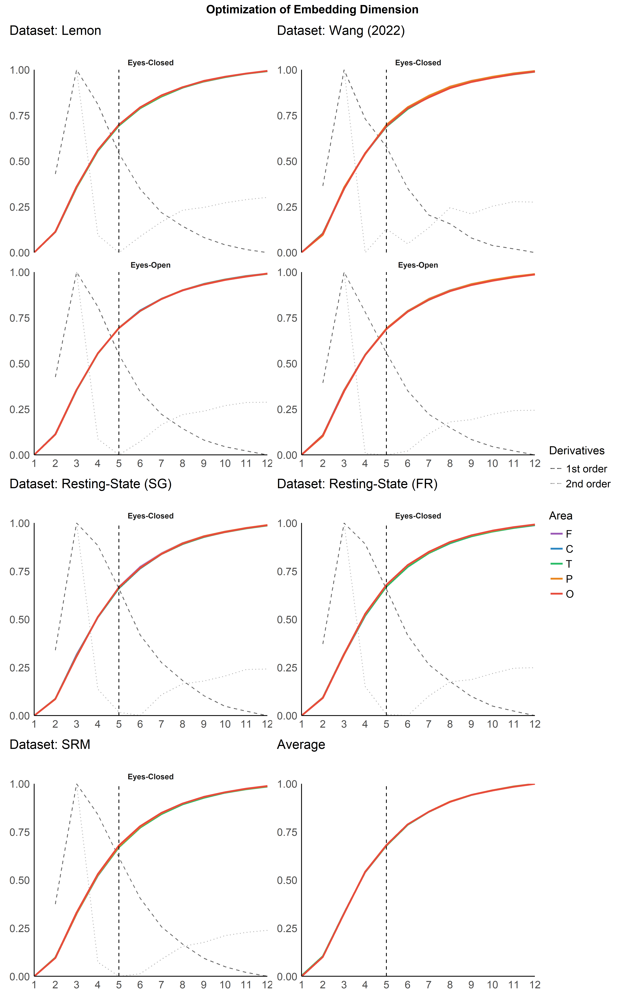
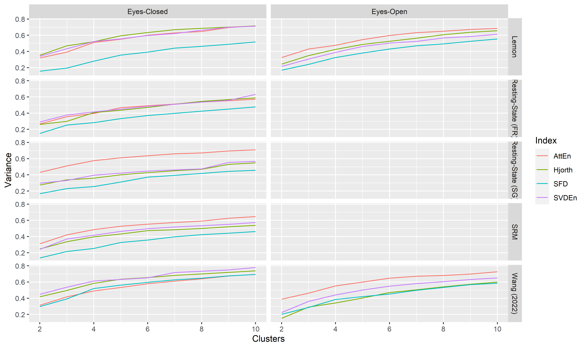
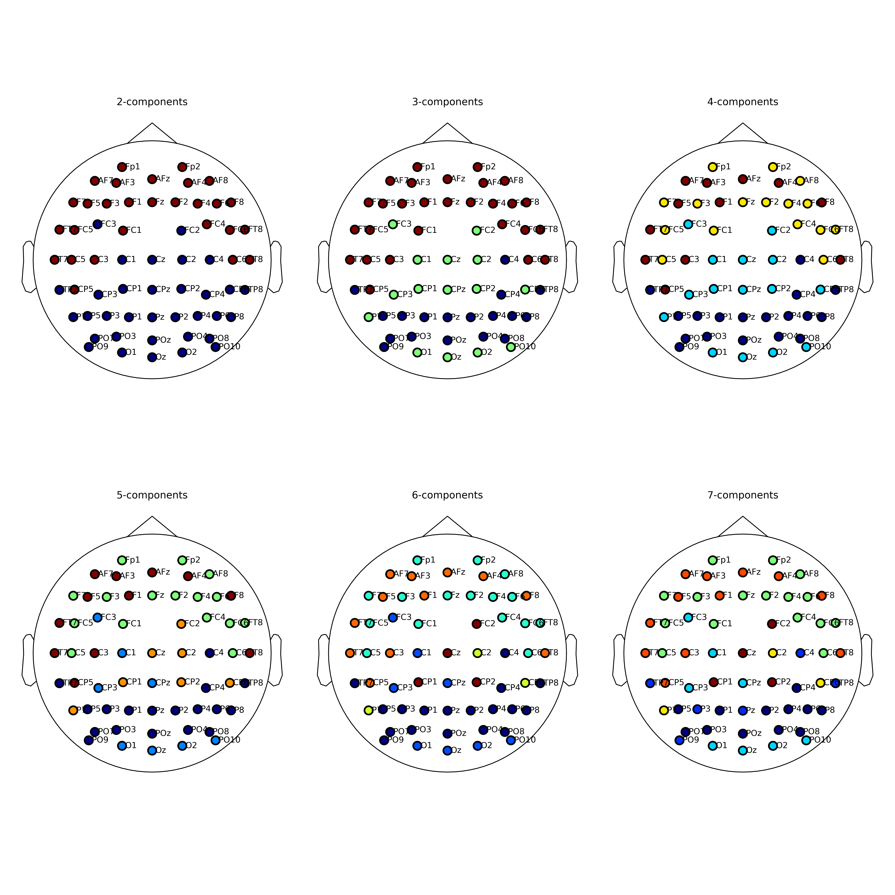
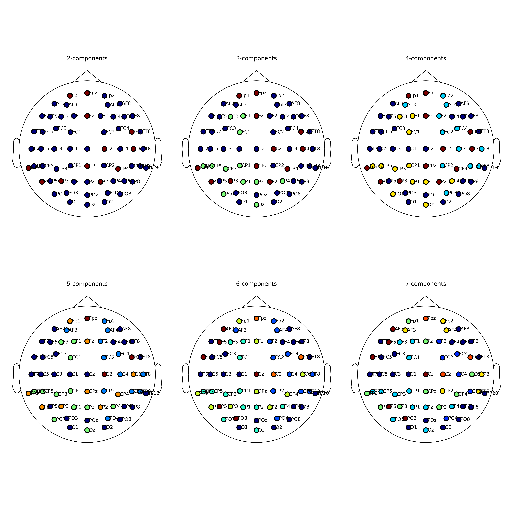
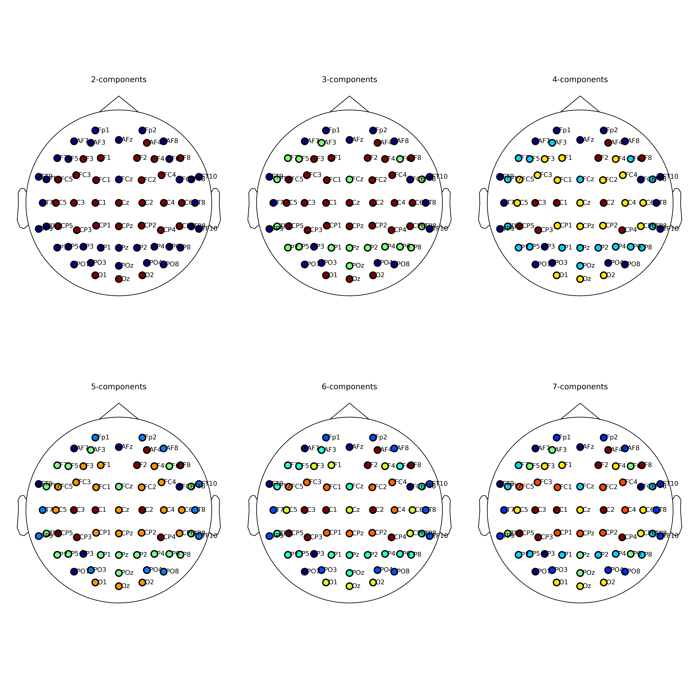

Optimal Selection of Delay and Embedding Dimension for EEG Complexity
Analysis
================

-   [Introduction](#introduction)
-   [Methods](#methods)
-   [Results](#results)
    -   [Optimization of Delay](#optimization-of-delay)
    -   [Optimization of Dimension](#optimization-of-dimension)
    -   [Topological Clusters](#topological-clusters)
-   [Discussion](#discussion)
-   [References](#references)

*This study can be referenced by* [*citing the package and the
documentation*](https://neuropsychology.github.io/NeuroKit/cite_us.html).

**We’d like to improve this study, but unfortunately we currently don’t
have the time. If you want to help to make it happen, please contact
us!**

## Introduction

The aim is to assess the optimal complexity parameters for EEG signals.

## Methods

``` r
library(tidyverse)
library(easystats)
library(patchwork)
```

``` r
read.csv("data_delay.csv") |> 
  group_by(Dataset) |>
  summarise(Sampling_Rate = mean(Sampling_Rate),
            Original_Frequencies = dplyr::first(Original_Frequencies),
            Lowpass = mean(Lowpass),
            n_Participants = n_distinct(Participant),
            n_Channels = n_distinct(Channel))
## # A tibble: 5 × 6
##   Dataset       Sampling_Rate Original_Freque… Lowpass n_Participants n_Channels
##   <chr>                 <dbl> <chr>              <dbl>          <int>      <int>
## 1 Lemon                   250 0.0-125.0             50            108         61
## 2 Resting-Stat…          1000 0.0-280.0             50             37         63
## 3 Resting-Stat…          1000 0.0-500.0             50             44        126
## 4 SRM                    1024 0.0-512.0             50            111         64
## 5 Wang (2022)             500 0.0-250.0             50             59         62
```

## Results

### Optimization of Delay

``` r
data_delay <- read.csv("data_delay.csv") |> 
  mutate(Metric = fct_relevel(Metric, "Mutual Information"),
         Value = Value/Sampling_Rate*1000,
         Optimal = Optimal/Sampling_Rate*1000,
         Optimal = Optimal) |> 
  mutate(Area = str_remove_all(Channel, "[:digit:]|z"),
         Area = substring(Channel, 1, 1),
         Area = case_when(Area == "I" ~ "O",
                          Area == "A" ~ "F",
                          TRUE ~ Area),
         Area = fct_relevel(Area, c("F", "C", "T", "P", "O")))
         

# summarize(group_by(data_delay, Dataset), Value = max(Value, na.rm=TRUE))
```

``` r
# data_delay |> 
#   mutate(group = paste0(Dataset, "_", Metric)) |> 
#   estimate_density(method="kernel", select="Optimal", at = "group") |> 
#   separate("group", into = c("Dataset", "Metric")) |> 
#   ggplot(aes(x = x, y = y)) +
#   geom_line(aes(color = Dataset)) +
#   facet_wrap(~Metric, scales = "free_y")
```

#### Per Channel

``` r
delay_perchannel <- function(data_delay, dataset="Lemon") {
  data <- filter(data_delay, Dataset == dataset) |> 
    group_by(Metric) |> 
    mutate(Score = 1 + normalize(Score) * 100) |> 
    ungroup()
  
  by_channel <- data |> 
    group_by(Condition, Metric, Area, Channel, Value) |> 
    summarise_all(mean, na.rm=TRUE) 
  by_area <- data |> 
    group_by(Condition, Metric, Area, Value) |> 
    summarise_all(mean, na.rm=TRUE) 
  
  p <- by_channel |> 
    ggplot(aes(x = Value, y = Score, color = Area)) +
    geom_line(aes(group=Channel), alpha = 0.20) +
    geom_line(data=by_area, aes(group=Area), size=1) +
    geom_vline(xintercept = c(27), linetype = "dashed", size = 0.5) +
    geom_vline(xintercept = c(25, 30), linetype = "dotted", size = 0.5) +
    see::scale_color_flat_d(palette = "rainbow") +
    scale_y_log10(expand = c(0, 0)) +
    scale_x_continuous(expand = c(0, 0)) +
    #                    limits = c(0, NA), 
    #                    breaks=c(5, seq(0, 80, 20)), 
    #                    labels=c(5, seq(0, 80, 20))) +
    labs(title = paste0("Dataset: ", dataset), x = NULL, y = NULL) +
    guides(colour = guide_legend(override.aes = list(alpha = 1))) +
    see::theme_modern() +
    theme(plot.title = element_text(face = "plain", hjust = 0))
  
  if(length(unique(data$Condition)) > 1) {
    p <- p + facet_wrap(~Condition, scales = "free_y", nrow=2) 
  } else {
    p <- p + facet_wrap(~Condition, scales = "free_y", nrow=1) 
  }
  p
}

p1 <- delay_perchannel(data_delay, dataset="Lemon")
p2 <- delay_perchannel(data_delay, dataset="SRM")
p3 <- delay_perchannel(data_delay, dataset="Wang (2022)")
p4 <- delay_perchannel(data_delay, dataset="Resting-State (SG)")
p5 <- delay_perchannel(data_delay, dataset="Resting-State (FR)")


m <- mgcv::bam(Score ~ s(Value, by=Area, k=-1, bs="cs") + 
                 s(Dataset, bs="re"),
               data=data_delay |> 
                 mutate(Dataset=as.factor(Dataset)))

p6 <- estimate_relation(m, at=c("Value", "Area"), show_data=FALSE) |>
  mutate(Predicted = 1 + normalize(Predicted) * 100) |>
  ggplot(aes(x = Value, y = Predicted, color = Area)) +
  geom_line(size=1) +
  geom_vline(xintercept = c(27), linetype = "dashed", size = 0.5) +
  geom_vline(xintercept = c(25, 30), linetype = "dotted", size = 0.5) +
  see::scale_color_flat_d(palette = "rainbow") +
  scale_y_log10(expand = c(0, 0)) +
  scale_x_continuous(expand = c(0, 0)) +
  labs(title = "Average", x = NULL, y = NULL) +
  see::theme_modern()  +
  guides(color="none")
  
# p6 <- data_delay |> 
#   group_by(Area, Value) |> 
#   summarise(Score = mean(Score)) |> 
#   mutate(Score = 1 + normalize(Score) * 100) |> 
#   ggplot(aes(x = Value, y = Score, color = Area))  +
#   # geom_point2(size=3, alpha=0.3) +
#   geom_line(size=0.5) +
#   geom_smooth(size=1, se=FALSE, method = 'loess') +
#   geom_vline(xintercept = c(27), linetype = "dashed", size = 0.5) +
#   see::scale_color_flat_d(palette = "rainbow") +
#   scale_y_log10(expand = c(0, 0)) +
#   scale_x_continuous(expand = c(0, 0)) +
#   labs(title = "Average", x = NULL, y = NULL) +
#   see::theme_modern()  +
#   guides(color="none")
    
(p1 | p3) / (p4 | p5) / (p2 | p6) + plot_layout(heights = c(2, 1, 1), guides="collect") +
  plot_annotation(title = "Optimization of Delay", theme = theme(plot.title = element_text(hjust = 0.5, face = "bold")))
```

<!-- -->

<!-- #### Per Subject -->
<!-- ```{r delay_persubject, warning=FALSE, message=FALSE, fig.height=16, fig.width=10} -->
<!-- delay_persubject <- function(data_delay, dataset="Lemon") { -->
<!--   data <- filter(data_delay, Dataset == dataset) |>  -->
<!--     mutate(Score = 1 + Score) -->
<!--   by_subject <- data |> -->
<!--     group_by(Condition, Metric, Area, Participant, Value) |> -->
<!--     summarise_all(mean) -->
<!--   by_area <- data |> -->
<!--     group_by(Condition, Metric, Area, Value) |> -->
<!--     summarise_all(mean) -->
<!--   by_subject |> -->
<!--     mutate(group = paste0(Participant, Area)) |> -->
<!--     ggplot(aes(x = Value, y = Score, color = Area)) + -->
<!--     geom_line(aes(group=group), alpha = 0.20) + -->
<!--     geom_line(data=by_area, aes(group=Area), size=1) + -->
<!--     geom_vline(xintercept = c(27), linetype = "dashed", size = 0.5) + -->
<!--     facet_wrap(~Condition*Metric, scales = "free_y") + -->
<!--     see::scale_color_flat_d(palette = "rainbow") + -->
<!--     scale_y_log10(expand = c(0, 0)) + -->
<!--     scale_x_continuous(expand = c(0, 0),  -->
<!--                        limits = c(0, NA),  -->
<!--                        breaks=c(5, seq(0, 80, 20)),  -->
<!--                        labels=c(5, seq(0, 80, 20))) + -->
<!--     labs(title = paste0("Dataset: ", dataset), x = NULL, y = NULL) + -->
<!--     guides(colour = guide_legend(override.aes = list(alpha = 1))) + -->
<!--     see::theme_modern() + -->
<!--     theme(plot.title = element_text(face = "plain", hjust = 0)) -->
<!-- } -->
<!-- p1 <- delay_persubject(data_delay, dataset="Lemon") -->
<!-- # p2 <- delay_persubject(data_delay, dataset="Texas") -->
<!-- p3 <- delay_persubject(data_delay, dataset="SRM") -->
<!-- p4 <- delay_persubject(data_delay, dataset="Wang (2022)") -->
<!-- p1 / p3 / p4 + -->
<!--   plot_layout(heights = c(2, 1, 2)) + -->
<!--   plot_annotation(title = "Optimization of Delay", theme = theme(plot.title = element_text(hjust = 0.5, face = "bold"))) -->
<!-- ``` -->

#### Attractors

``` r
data <- read.csv("data_attractor.csv")

p <- data |> 
  mutate(Delay = Delay/Sampling_Rate*1000,
         Channel = fct_relevel(Channel, "Fz", "Cz", "Pz", "Oz"),
         z = normalize(z)) |> 
  ggplot(aes(x = x, y = y)) +
  geom_path(aes(alpha=Time, color=z), size=0.1) +
  facet_grid(Channel~Dataset, scales="free", switch="y") +
  guides(alpha="none") +
  labs(title = "EEG Attractors", 
       subtitle = "(30 seconds of signal)", 
       x = expression("Voltage at"~italic(t[0])), 
       # y = expression("Voltage at"~italic(t[0]~+~"τ")~" (27 ms)"),
       y = expression("Voltage at"~italic(t[0])~" + 27 ms")) +
  scale_y_continuous(expand = c(0, 0)) +
  scale_x_continuous(expand = c(0, 0)) +
  # scale_color_manual(values=c("Fz"="#4A148C", "Cz"="#1B5E20", "Pz"="#E65100", "Oz"="#F57F17")) +
  # scale_color_manual(values=c("Fz"="#18062E", "Cz"="#09200A", "Pz"="#4C1B00", "Oz"="#512B07")) +
  scale_colour_gradientn(colours = c("#FF9800", "#F44336", "black", "#1E88E5", "#4CAF50"), guide="none") +
  coord_cartesian(xlim = c(-5, 5), ylim = c(-5, 5)) +
  theme_minimal() +
  theme(panel.background = element_rect(fill = "#FFFCF0"),
        panel.grid.major = element_blank(),
        panel.grid.minor = element_blank(),
        axis.text = element_blank(),
        axis.ticks = element_blank(),
        plot.title = element_text(hjust = 0.5, face = "bold"),
        plot.subtitle = element_text(hjust = 0.5, face = "italic"))

ggsave("figures/attractors2D.png", width=15, height=15, dpi=300)
```

<!-- -->

### Optimization of Dimension

``` r
data_dim <- read.csv("data_dimension.csv") |> 
  mutate(Area = str_remove_all(Channel, "[:digit:]|z"),
         Area = substring(Channel, 1, 1),
         Area = case_when(Area == "I" ~ "O",
                          Area == "A" ~ "F",
                          TRUE ~ Area),
         Area = fct_relevel(Area, c("F", "C", "T", "P", "O")))
```

#### Per Channel

``` r
dim_perchannel <- function(data_dim, dataset="Lemon") {
  data <- filter(data_dim, Dataset == dataset) |> 
    mutate(Score = normalize(Score))
  
  by_channel <- data |> 
    group_by(Condition, Area, Channel, Value) |> 
    summarise_all(mean, na.rm=TRUE) 
  by_area <- data |> 
    group_by(Condition, Area, Value) |> 
    summarise_all(mean, na.rm=TRUE) 
  deriv <- data |> 
    group_by(Condition, Value) |> 
    summarise_all(mean, na.rm=TRUE) |> 
    mutate(Score = normalize(Score - lag(Score)),
           Score2 = normalize(Score - lag(Score)))
  
  by_channel |> 
    mutate(Value = as.factor(Value)) |> 
    ggplot(aes(x = Value, y = Score)) +
    geom_line(data=deriv, aes(alpha = "1st order"), linetype="dashed") +
    geom_line(data=deriv, aes(y=Score2, alpha="2nd order"), linetype="dotted") +
    geom_line(aes(group=Channel, color = Area), alpha = 0.20) +
    geom_line(data=by_area, aes(group=Area, color = Area), size=1) +
    geom_vline(xintercept = c(5), linetype = "dashed", size = 0.5) +
    facet_wrap(~Condition, ncol=1, scales = "free_y") +
    see::scale_color_flat_d(palette = "rainbow") +
    scale_y_continuous(expand = c(0, 0)) +
    scale_x_discrete(expand = c(0, 0)) +
    scale_alpha_manual(values=c("1st order"=0.6, "2nd order"=0.3)) +
    labs(title = paste0("Dataset: ", dataset), x = NULL, y = NULL, alpha="Derivatives") +
    guides(colour = guide_legend(override.aes = list(alpha = 1))) +
    see::theme_modern() +
    theme(plot.title = element_text(face = "plain", hjust = 0)) 
}

p1 <- dim_perchannel(data_dim, dataset="Lemon")
p2 <- dim_perchannel(data_dim, dataset="SRM")
p3 <- dim_perchannel(data_dim, dataset="Wang (2022)")
p4 <- dim_perchannel(data_dim, dataset="Resting-State (SG)")
p5 <- dim_perchannel(data_dim, dataset="Resting-State (FR)")


m <- mgcv::bam(Score ~ s(Value, by=Area, k=-1, bs="cs") + 
                 s(Dataset, bs="re"),
               data=data_dim |> 
                 mutate(Dataset=as.factor(Dataset)))

p6 <- estimate_relation(m, at=list("Value" = unique(data_dim$Value), 
                                   "Area" = unique(data_dim$Area))) |>
  mutate(Predicted = normalize(Predicted)) |>
  ggplot(aes(x = as.factor(Value), y = Predicted, color = Area)) +
  geom_line(aes(group=Area), size=1) +
  geom_vline(xintercept = c(5), linetype = "dashed", size = 0.5) +
  see::scale_color_flat_d(palette = "rainbow") +
  scale_y_continuous(expand = c(0, 0)) +
  scale_x_discrete(expand = c(0, 0)) +
  labs(title = "Average", x = NULL, y = NULL) +
  see::theme_modern()  +
  guides(color="none")

(p1 | p3) / (p4 | p5) / (p2 | p6) + plot_layout(heights = c(2, 1, 1), guides="collect") +
  plot_annotation(title = "Optimization of Embedding Dimension", theme = theme(plot.title = element_text(hjust = 0.5, face = "bold")))
```

<!-- -->

<!-- #### 3D Attractors -->
<!-- ```{r attractors3D, eval=FALSE, warning=FALSE, message=FALSE, fig.height=16, fig.width=10} -->
<!-- library(plotly) -->
<!-- data <- read.csv("data_attractor.csv") -->
<!-- plots <- list() -->
<!-- for(i in unique(data$Dataset)) { -->
<!--   plots[[i]] <- plot_ly(data[data$Dataset == i, ],  -->
<!--                x = ~x,  -->
<!--                y = ~y,  -->
<!--                z = ~z,  -->
<!--                type = 'scatter3d',  -->
<!--                mode = 'lines', -->
<!--                opacity = 0.8,  -->
<!--                line = list(width = 0.5,  -->
<!--                            color = ~c,  -->
<!--                            colorscale = 'Viridis')) -->
<!-- } -->
<!-- plots[["Lemon"]] -->
<!-- ``` -->

### Topological Clusters

``` r
df <- read.csv("data_complexity.csv") |> 
  mutate(Channel = ifelse(Channel=="Cpz", "CPz", Channel))
  
data <- df |> 
  pivot_longer(-c(Channel, Participant, Condition, Dataset), 
               names_to = "Index", values_to = "Value") |> 
  group_by(Dataset, Condition, Index) |> 
  mutate(Value = standardize(Value)) |> 
  ungroup()

data_varex <- data.frame()
data_clusters <- list()
for(dataset in unique(df$Dataset)) {
  dat1 <- data[data$Dataset == dataset, ]
  
  print(dataset)
  list_clusters <- list()
  for(condition in unique(dat1$Condition)) {
    dat2 <- dat1[dat1$Condition == condition, ]
    
    for(index in unique(dat2$Index)) {
      
      dat3 <- dat2[dat2$Index == index, ] |> 
        pivot_wider(values_from = "Value", names_from = "Channel") |> 
        select_if(is.numeric) |> 
        data_transpose()
      dat3[is.na(dat3)] <- 0
      
      
      for(n in 2:10) {
        for(method in c("hkmeans", "pam", "hclust")) {
          rez <- parameters::cluster_analysis(dat3, n=n, method=method)
          perf <- attributes(rez)$performance
          varex <- data.frame(Clusters=n, 
                              Variance=perf$R2, 
                              Dataset=dataset,
                              Condition=condition,
                              Index=index,
                              Method = method)
          data_varex <- rbind(data_varex, varex)
          list_clusters[[paste0(index, n, condition, method)]] <- setNames(predict(rez), row.names(dat3))
        }
      }
    }
  }
  data_clusters[[dataset]] <- cluster_meta(list_clusters)
}
## [1] "Lemon"
## [1] "SRM"
## [1] "Wang (2022)"
## [1] "Resting-State (SG)"
## [1] "Resting-State (FR)"

data_varex |> 
  filter(Method == "hkmeans") |> 
  ggplot(aes(x=Clusters, y=Variance)) +
  geom_line(aes(color=Index)) +
  facet_grid(Dataset~Condition)
```

<!-- -->

``` r
structures <- list()
for(n in 2:7) {
  for(dataset in unique(df$Dataset)) {
    structures[[paste0(n, "_", dataset)]] <- predict(data_clusters[[dataset]], n=n)
  }
}


ch_names <- lapply(structures, function(x) names(x))
structures <- lapply(structures, function(x) as.character(x))

# predict.cluster_meta(m, n=4)
# heatmap(m)
```

``` python
import TruScanEEGpy
import mne
import numpy as np
import matplotlib.pyplot as plt
import matplotlib

matplotlib.use("Agg")
matplotlib.rcParams['axes.linewidth'] = 0

def plot_layout(closest, closest_names, **kwargs):
  if "Iz" not in closest_names:
      info = mne.create_info(closest_names, ch_types="eeg", sfreq=4000)
      info = info.set_montage(montage="easycap-M1")
  else:
    montage = TruScanEEGpy.montage_mne_128(TruScanEEGpy.layout_128('10-5'))
    info = mne.create_info(montage.ch_names, ch_types="eeg", sfreq=3000)
    info = info.set_montage(montage)
  
  groups = []
  for group in np.unique(closest):
      channels = np.array(closest_names)[np.array(closest) == group]
      groups.append(mne.pick_channels(info['ch_names'], include=channels))
  
  mne.viz.plot_sensors(info, ch_groups=groups, **kwargs)

def make_plot(dataset="Lemon"):
  fig = plt.figure(figsize=(15, 15))
  for i in range(1, 7):
    ax = fig.add_subplot(2, 3, i, title = str(i+1) + "-components")
    plot_layout(r.structures[str(i+1) + "_" + dataset], r.ch_names[str(i+1) + "_" + dataset], show_names=True, kind='topomap', pointsize=100, axes=ax)
  fig.tight_layout()
  return fig

fig1 = make_plot(dataset="Lemon")
plt.show()
```

<!-- -->

``` python
fig2 = make_plot(dataset="SRM")
plt.show()
```

<!-- -->

``` python
fig3 = make_plot(dataset="Wang (2022)")
plt.show()
```

<!-- -->

``` python
fig4 = make_plot(dataset="Resting-State (SG)")
plt.show()
```

<!-- -->

``` python
fig5 = make_plot(dataset="Resting-State (FR)")
plt.show()
```

<!-- -->

## Discussion

In conclusion, the optimal delay for resting state EEG, accross
different datasets, was estimated to be between 25 and 30 ms. 27 ms,
which corresponds to a frequency of 37.037 Hz, is a possible value.

## References
