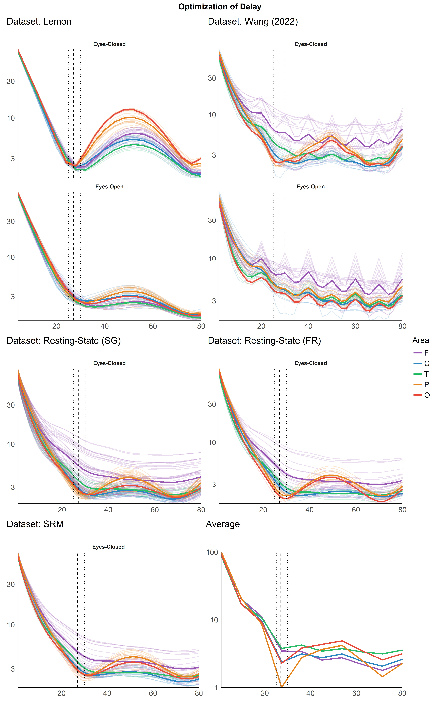
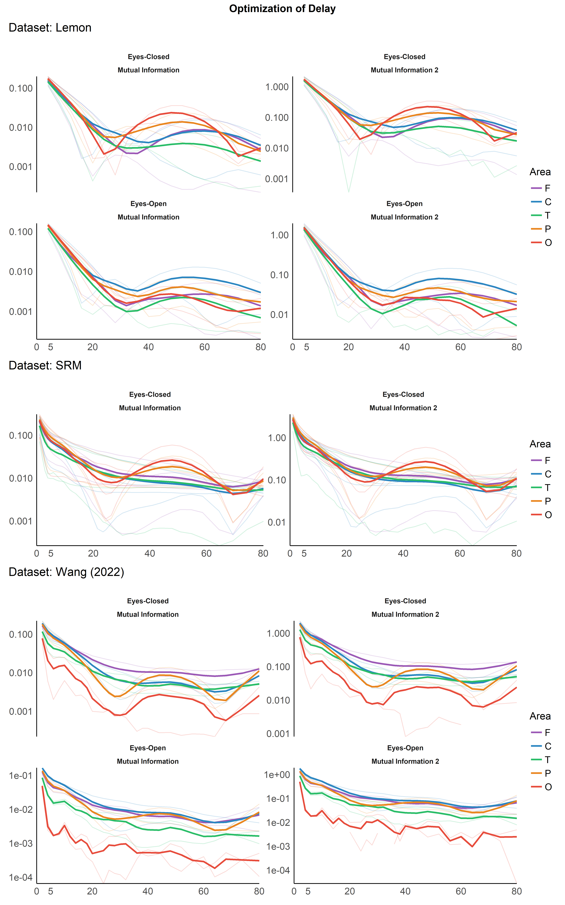

Optimal Selection of Delay, Embedding Dimension and Tolerance for EEG
Complexity Analysis
================

-   [Introduction](#introduction)
-   [Methods](#methods)
-   [Results](#results)
    -   [Optimization of Delay](#optimization-of-delay)
    -   [Optimization of Dimension](#optimization-of-dimension)
-   [References](#references)

*This study can be referenced by* [*citing the package and the
documentation*](https://neuropsychology.github.io/NeuroKit/cite_us.html).

**We’d like to improve this study, but unfortunately we currently don’t
have the time. If you want to help to make it happen, please contact
us!**

## Introduction

The aim is to assess the optimal complexity parameters.

## Methods

``` r
library(tidyverse)
library(easystats)
library(patchwork)
```

``` r
read.csv("data_delay.csv") |> 
  group_by(Dataset) |>
  summarise(Sampling_Rate = mean(Sampling_Rate),
            Original_Frequencies = dplyr::first(Original_Frequencies),
            Lowpass = mean(Lowpass),
            n_Participants = n_distinct(Participant),
            n_Channels = n_distinct(Channel))
## # A tibble: 3 × 6
##   Dataset     Sampling_Rate Original_Frequenc… Lowpass n_Participants n_Channels
##   <chr>               <dbl> <chr>                <dbl>          <int>      <int>
## 1 Lemon                 250 0.0-125.0              120              2         61
## 2 SRM                  1024 0.0-512.0              120              4         64
## 3 Wang (2022)           500 0.0-250.0              120              2         61
```

## Results

### Optimization of Delay

``` r
data_delay <- read.csv("data_delay.csv") |> 
  mutate(Metric = fct_relevel(Metric, "Mutual Information", "Mutual Information 2"),
         Value = Value/Sampling_Rate*1000,
         Optimal = Optimal/Sampling_Rate*1000,
         Optimal = Optimal) |> 
  mutate(Area = str_remove_all(Channel, "[:digit:]|z"),
         Area = substring(Channel, 1, 1),
         Area = case_when(Area == "I" ~ "O",
                          Area == "A" ~ "F",
                          TRUE ~ Area),
         Area = fct_relevel(Area, c("F", "C", "T", "P", "O")))
         

# summarize(group_by(data_delay, Dataset), Value = max(Value, na.rm=TRUE))
```

``` r
# data_delay |> 
#   mutate(group = paste0(Dataset, "_", Metric)) |> 
#   estimate_density(method="kernel", select="Optimal", at = "group") |> 
#   separate("group", into = c("Dataset", "Metric")) |> 
#   ggplot(aes(x = x, y = y)) +
#   geom_line(aes(color = Dataset)) +
#   facet_wrap(~Metric, scales = "free_y")
```

#### Per Channel

``` r
delay_perchannel <- function(data_delay, dataset="Lemon") {
  data <- filter(data_delay, Dataset == dataset) |> 
    mutate(Score = Score + 1)
  
  by_channel <- data |> 
    group_by(Condition, Metric, Area, Channel, Value) |> 
    summarise_all(mean, na.rm=TRUE) 
  by_area <- data |> 
    group_by(Condition, Metric, Area, Value) |> 
    summarise_all(mean, na.rm=TRUE) 
  
  by_channel |> 
    ggplot(aes(x = Value, y = Score, color = Area)) +
    geom_line(aes(group=Channel), alpha = 0.20) +
    geom_line(data=by_area, aes(group=Area), size=1) +
    geom_vline(xintercept = c(25), linetype = "dashed", size = 0.5) +
    facet_wrap(~Condition*Metric, scales = "free_y") +
    see::scale_color_flat_d(palette = "rainbow") +
    scale_y_log10(expand = c(0, 0)) +
    scale_x_continuous(expand = c(0, 0), 
                       limits = c(0, NA), 
                       breaks=c(5, seq(0, 80, 20)), 
                       labels=c(5, seq(0, 80, 20))) +
    labs(title = paste0("Dataset: ", dataset), x = NULL, y = NULL) +
    guides(colour = guide_legend(override.aes = list(alpha = 1))) +
    see::theme_modern() +
    theme(plot.title = element_text(face = "plain", hjust = 0))
}

p1 <- delay_perchannel(data_delay, dataset="Lemon")
# p2 <- delay_perchannel(data_delay, dataset="Texas")
p3 <- delay_perchannel(data_delay, dataset="SRM")
p4 <- delay_perchannel(data_delay, dataset="Wang (2022)")

p1 / p3 / p4 + 
  plot_layout(heights = c(2, 1, 2)) + 
  plot_annotation(title = "Optimization of Delay", theme = theme(plot.title = element_text(hjust = 0.5, face = "bold")))
```

<!-- -->

#### Per Subject

``` r
delay_persubject <- function(data_delay, dataset="Lemon") {
  data <- filter(data_delay, Dataset == dataset)

  by_subject <- data |>
    group_by(Condition, Metric, Area, Participant, Value) |>
    summarise_all(mean)
  by_area <- data |>
    group_by(Condition, Metric, Area, Value) |>
    summarise_all(mean)

  by_subject |>
    mutate(group = paste0(Participant, Area)) |>
    ggplot(aes(x = Value, y = Score, color = Area)) +
    geom_line(aes(group=group), alpha = 0.20) +
    geom_line(data=by_area, aes(group=Area), size=1) +
    # geom_vline(xintercept = 10, linetype = "dashed", size = 0.5) +
    facet_wrap(~Condition*Metric, scales = "free_y") +
    see::scale_color_flat_d(palette = "rainbow") +
    scale_y_log10(expand = c(0, 0)) +
    scale_x_continuous(expand = c(0, 0), 
                       limits = c(0, NA), 
                       breaks=c(5, seq(0, 80, 20)), 
                       labels=c(5, seq(0, 80, 20))) +
    labs(title = paste0("Dataset: ", dataset), x = NULL, y = NULL) +
    guides(colour = guide_legend(override.aes = list(alpha = 1))) +
    see::theme_modern() +
    theme(plot.title = element_text(face = "plain", hjust = 0))
}

p1 <- delay_persubject(data_delay, dataset="Lemon")
# p2 <- delay_persubject(data_delay, dataset="Texas")
p3 <- delay_persubject(data_delay, dataset="SRM")
p4 <- delay_persubject(data_delay, dataset="Wang (2022)")

p1 / p3 / p4 +
  plot_layout(heights = c(2, 1, 2)) +
  plot_annotation(title = "Optimization of Delay", theme = theme(plot.title = element_text(hjust = 0.5, face = "bold")))
```

<!-- -->

#### 2D Attractors

``` r
data <- read.csv("data_attractor2D.csv")

data |> 
  mutate(Delay = Delay/Sampling_Rate*1000) |> 
  ggplot(aes(x = x, y = y)) +
  geom_path(aes(alpha=Time), size=0.1) +
  facet_grid(Channel~Dataset, scales="free", switch="y") +
  guides(alpha="none") +
  labs(x = expression("Voltage at"~italic(t[0])), y = expression("Voltage at"~italic(t[0]~+~"τ"))) +
  scale_y_continuous(expand = c(0, 0)) +
  scale_x_continuous(expand = c(0, 0)) +
  coord_cartesian(xlim = c(-5, 5), ylim = c(-5, 5)) +
  theme_minimal() +
  theme(panel.background = element_rect(fill = "#FFFCF0"),
        panel.grid.major = element_blank(),
        panel.grid.minor = element_blank(),
        axis.text = element_blank(),
        axis.ticks = element_blank())
```

### Optimization of Dimension

## References
